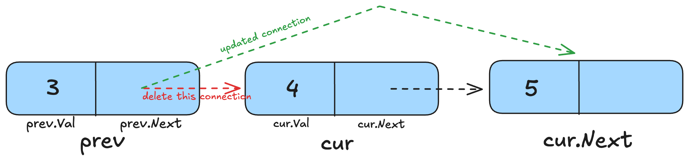

# Deleting a Node in Linked Lists

After going through the previous two posts on linked lists, you should be getting comfortable working with them. Similar to the `InsertAfter` and `InsertBefore` methods in the [previous post](./linked-lists-insert.md), we'll be taking a look at the `DeleteAfter` and `DeleteBefore` methods in this post.

The `DeleteAfter` method deletes the node after the specified `target`. Here's what the code for this looks like:

```go
func (ll *LinkedList) DeleteAfter(target int) {
	if ll.Head == nil {
		fmt.Println("LinkedList is empty.")
		return
	}

	cur := ll.Head

	for cur != nil {
		if cur.Val == target {
			if cur.Next == nil {
				fmt.Printf("There's nothing to delete after %d\n", target)
			} else {
				cur.Next = cur.Next.Next
			}
			return
		}
		cur = cur.Next
	}
	fmt.Printf("%d wasn't found in the LinkedList.\n", target)
}
```

Like all the times before, we first check if the linked list is empty or not.

Then we iterate till we find the node that matches our target. Now the node after this is to be deleted. We first check if this is the last node or not (`cur.Next == nil`) because if it is, then there's nothing to delete after this.

In case it isn't the last node, we simply remove the next node from the linked list by updating this node's reference (which was stored in `cur.Next`) to point to the node that comes after the node to be deleted (`cur.Next.Next`).

Finally, if our method hasn't returned by now, it means we weren't able to find the `target` in the entire linked list.

Easy peasy? Spend some time writing this code yourself if you're not able to understand it immediately.

Let's move on to the `DeleteBefore` method now:

```go
func (ll *LinkedList) DeleteBefore(target int) {
	if ll.Head == nil {
		fmt.Println("LinkedList is empty")
		return
	}

	// if the first node is the target
	if ll.Head.Val == target {
		fmt.Println("Nothing to delete before ", ll.Head.Val)
		return
	}

	var prev *Node = nil
	cur := ll.Head

	for cur.Next != nil {
		// this means we have to delete the cur node
		if cur.Next.Val == target {
			// when the first node has to be deleted
			if prev == nil {
				ll.Head = cur.Next
			} else {
				prev.Next = cur.Next
			}
			return
		}
		prev = cur
		cur = cur.Next
	}
	fmt.Printf("%d wasn't found in the LinkedList.\n", target)
}
```

After checking if the linked list is empty or not, we check if the target is the first node. If it is, then there's nothing before it to delete.

After that, we iterate through the linked list starting from the head but also keep track of the node before the `cur` node using `prev`. `prev` is set to `nil` at first. While iterating, we keep checking if the `Next` node matches the `target`, because if it does, it means the current node is to be deleted.

If `prev` is equal to `nil`, that means the loop is in its first iteration and the `cur` node is still at the value it was initialized with: the head of the linked list. In this case, we have to delete this head. So, we simply update the head of the linked list to point to the second node, which is stored in `cur.Next`.

In all other cases (i.e., deleting a node other than the head), we simply update the `prev` node's `Next` (which was pointing to `cur`) to point to the `cur` node's `Next`. This way, we remove the `cur` node from the linked list. Here's a diagram to help you visualize:



At the end of each iteration of the loop, we first store the `cur` node in `prev` and then move the `cur` pointer to the next node.

Finally, like all other times before, if no `return` statement was executed, it means the `target` wasn't found in the linked list.