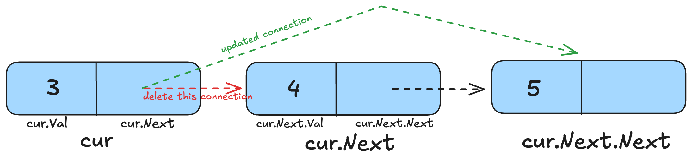

# Basics of Linked Lists

In this section, we’ll cover the basics of creating and working with Linked Lists in Go: how to define them, how to insert a node at the end, how to delete a node, and how to display the linked list.

Let’s first start with how we represent linked lists. We define two `types`, both of which are `structs`. One type represents the `Node` of a linked list, which contains information about the value in that node and what the next node is. The `LinkedList` struct simply stores where the head (or the starting point) of the linked list is. You can technically get away with not defining the linked list type and initializing the head as a `Node` in the `main` function, but doing things this way makes it easier to define methods and work with the linked list.

```go
package main

import "fmt"

type Node struct {
	Val  int
	Next *Node
}

type LinkedList struct {
	Head *Node
}

func (ll *LinkedList) Insert(val int) {...}
func (ll *LinkedList) Display() {...}
func (ll *LinkedList) Delete(val int) {...}

func main() {
	ll := LinkedList{}
	ll.Insert(2)
	ll.Insert(3)
	ll.Insert(4)
	ll.Insert(5)
	ll.Display()
	ll.Delete(4)
	ll.Display()
}
```

Now that we have an understanding of what our linked list looks like, let's see how we can implement the `Insert` function:

```go
func (ll *LinkedList) Insert(val int) {
	node := &Node{Val: val, Next: nil}

	if ll.Head == nil {
		ll.Head = node
	} else {
		cur := ll.Head
		for cur.Next != nil {
			cur = cur.Next
		}
		cur.Next = node
	}
}
```

Since we are inserting the node at the end, the `Next` for this node will always be `nil`. So the first thing we do in this function is create the new node which is to be inserted. Then we check if the linked list is empty by checking if the head points to `nil` or not. If that's the case, then that means the new node is the only one in the linked list and it is to be made the head of the linked list.

In case the linked list already exists (has a head and possibly other nodes), we traverse the linked list until the final node. Make sure to understand this code really well because you'll see this used in many places when working with linked lists:

```go
for cur.Next != nil {
			cur = cur.Next
}
```

`cur.Next` is equal to `nil` only for the last node in the linked list. So this loop basically keeps moving `cur` until it reaches the last node.

Once that is the case, we just update the `Next` of this last node to point to the newly created node. So far so good?

Let's now see how to display the complete linked list. I promise it is simpler to understand now that you know how the `Insert` function works:

```go
func (ll *LinkedList) Display() {
	if ll.Head == nil {
		fmt.Println("LinkedList is empty")
		return
	}
	cur := ll.Head
	for cur.Next != nil {
		fmt.Printf("%d -> ", cur.Val)
		cur = cur.Next
	}
	fmt.Printf("%d\\n", cur.Val)
}
```

The code does the following:

- Check if the linked list is empty
- Traverse the linked list starting from the head and print out the value of the node + "→" until we reach the last node
- For the last node, we don't want any "→" after its value (since there's nothing after it), so after exiting the loop, we print its value.

Two methods done, just one more to understand :) Nice!

The `Delete` method deletes the node whose value you provide from the linked list:

```go
func (ll *LinkedList) Delete(val int) {
	if ll.Head == nil {
		fmt.Println("Nothing to delete")
		return
	}

	cur := ll.Head

	// if first node
	if cur.Val == val {
		ll.Head = cur.Next
		return
	}

	for cur.Next != nil {
		if cur.Next.Val == val {
			cur.Next = cur.Next.Next
			return
		}
		cur = cur.Next
	}

	fmt.Printf("%d wasn't found in the linked list\\n", val)
}
```

Just like with the other two methods, we first check if the linked list is empty or not before trying to delete. After that:

- We check if we have to delete the first node or not because if the first node is to be deleted, we have to update the linked list head to the node after it.
- If not, then we iterate until the last node using the same logic we did for the above two methods but with a check in between. If the node which is after the current node is to be deleted, we update the current node's `Next` to the `Next` of the node which is to be deleted. This effectively removes the `cur.Next` node from the linked list by breaking it from the chain.
- Finally, if none of the return statements were reached, that means the value to be deleted isn't present in the linked list.

Here's a diagram to help you understand the delete process better:



These were the three common operations that teach you the fundamentals of linked lists in Golang.